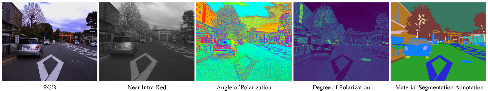
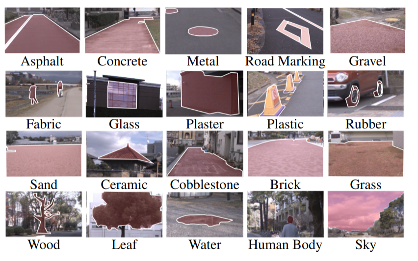
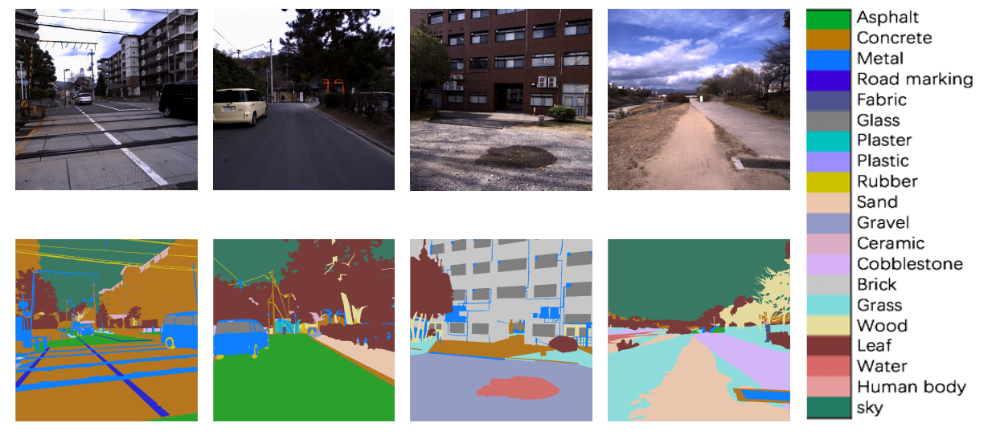
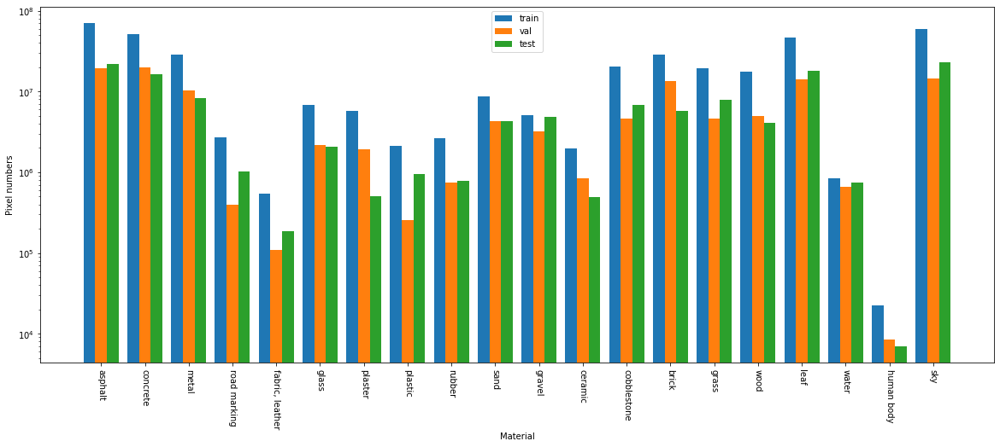

# Multimodal Material Segmentation, CVPR2022

This repository provides an inplementation of our paper [Multimodal Material Segmentation](https://openaccess.thecvf.com/content/CVPR2022/html/Liang_Multimodal_Material_Segmentation_CVPR_2022_paper.html) in CVPR 2022.  If you use our code and data, please cite our paper.
```
@InProceedings{Liang_2022_CVPR,
    author    = {Liang, Yupeng and Wakaki, Ryosuke and Nobuhara, Shohei and Nishino, Ko},
    title     = {Multimodal Material Segmentation},
    booktitle = {Proceedings of the IEEE/CVF Conference on Computer Vision and Pattern Recognition (CVPR)},
    month     = {June},
    year      = {2022},
    pages     = {19800-19808}
}
```

This implemenatation is based on [pytorch-deeplab-xception](https://github.com/jfzhang95/pytorch-deeplab-xception).  The diff can be found at [`pytorch-deeplab-xception-20191218.patch`](pytorch-deeplab-xception-20191218.patch).

Please note that this is research software and may contain bugs or other issues – please use it at your own risk. If you experience major problems with it, you may contact us, but please note that we do not have the resources to deal with all issues.


## Download data
The Multimodal Material Segmentation dataset (MCubeS dataset) is available in [Google Drive](https://drive.google.com/file/d/14egTCyC0Pampb7imrXVwaDRffHN7FZxh/view?usp=sharing) (`multimodal_dataset.zip`, 9.27GB). Uncompress the folder and move it to `/dataset/multimodal_dataset/`

The data should organized in the following format:
```
multimodal_dataset
├── polL_dolp
│   ├──outscene1208_2_0000000150.npy
│   ├──outscene1208_2_0000000180.npy
    ...
├── polL_color
│   ├──outscene1208_2_0000000150.png
│   ├──outscene1208_2_0000000180.png
    ...
├── polL_aolp_sin
├── polL_aolp_cos
├── list_folder
│   ├──all.txt
│   ├──test.txt
│   ├──train.txt
│   └──val.txt
├── SS
├── SSGT4MS
├── NIR_warped_mask
├── NIR_warped
└── GT
```
* polL_dolp: dolp data of each image set (represented as .npy file).
* polL_color: RGB image of each image set.
* polL_aolp_sin (cos): the sin (cos) value of aolp data of each image set (both represented as .npy file).
* list_folder: all.txt records the name of all image sets. Train/val/test.txt records the name of image sets assigned to train/val/test set. 
* SS: semantic annotation of each image set. The semantic labels here are the same as Cityscapes. 
* SSGT4MS: condensed semantic segmentation annotation of each image set. As depicted in Supplemental Material Section C, the 23 semantic classes of Cityscapes are consolidated into 10 classes. 
* NIR_warped_mask: mask of illegal region of each images set. Pixels in the white area will be excluded when computing the loss. 
* NIR_warped: NIR image of each image set.
* GT: material annotation of each image set. 
## Details of MCubeS dataset
### Overview
MCubeS captures the visual appearance of various materials found in daily outdoor scenes from a viewpoint on a road, pavement, or sidewalk. At each viewpoint, we capture images with three fundamentally different imaging modalities, RGB, polarization (represented as Aolp and Dolp), and near-infrared (NIR). There are 500 images sets in MCubeS dataset, and each pixel in RGB image is labeled as one of 13 material classes. 
<p align="center">  </p>

### Material labels
We define 20 distinct materials by thoroughly examining the data we captured in the MCubeS dataset. Examples of all materials are shown below. 
<p align="center">  </p>
Here are some annotation examples. 
<p align="center">  </p>

### Statistics
The pixel numbers of each material class in train, val and test set are shown below. 
<p align="center">  </p>

## Usage
### Prerequisites

We tested our code with Python 3.6.12 on Ubuntu 18.04 LTS.  Our code depends on the following modules.
* torch==1.7.1
* matplotlib==3.3.2
* numpy==1.19.2
* opencv_python==4.4.0.44

To install this package with pip, use the following command:
```
$ python3 -m pip install -r requirements.txt
```
in your (virtual) environment.
### Prepare of the semantic segmentation guidance
Train a semantic segmentation network model by images in `/dataset/multimodal_dataset/polL_color/` and `/dataset/multimodal_dataset/SSGT4MS/`. Put the semantic segmentation result images in `/dataset/multimodal_dataset/SSmask/`.
### Training and testing
* To train MCubeSNet, simply run 
```
$ sh main_train_multimodal.sh
```
* To test MCubeSNet, simply run 
```
$ sh main_test_multimodal.sh
```
